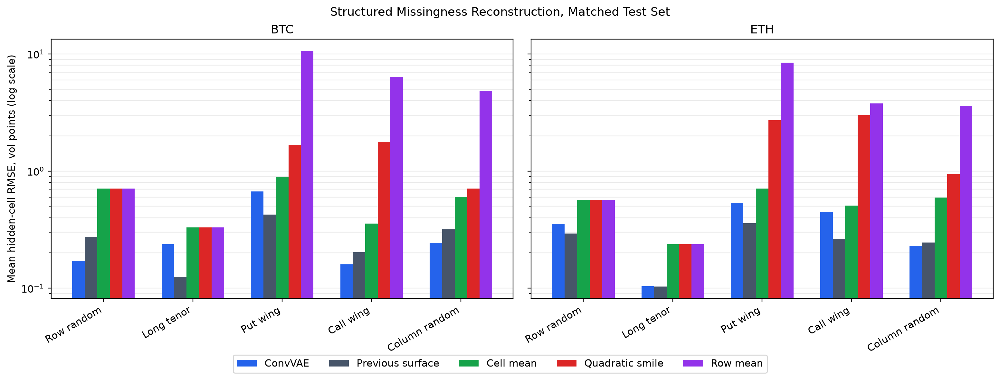
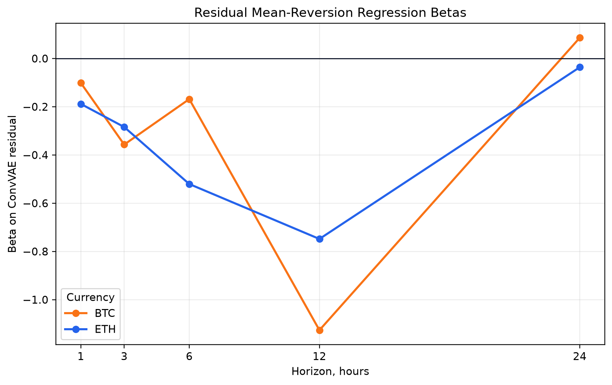
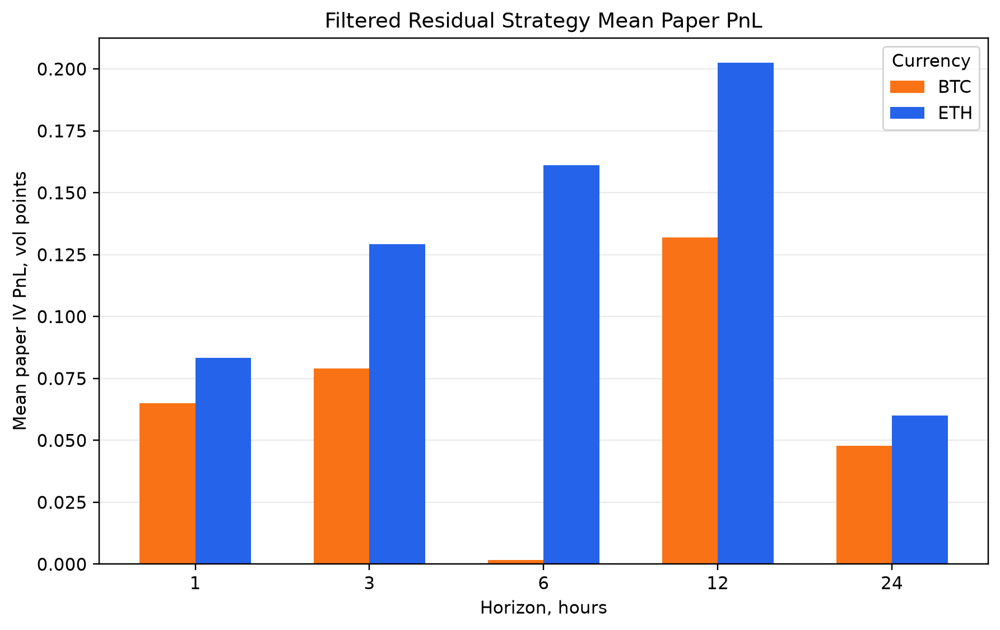
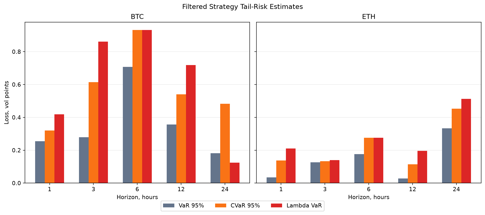

# Crypto Implied-Volatility Surface Learning for Relative-Value Signals and Lambda-VaR Risk Measurement

## Project Overview

This project studies whether a learned implied-volatility surface model can identify rich and cheap regions of the BTC and ETH options surface, and whether those residuals predict future IV mean reversion.

The workflow has three parts:

1. Train a convolutional variational autoencoder (ConvVAE) to reconstruct BTC/ETH implied-volatility surfaces.
2. Use ConvVAE residuals as relative-value signals and test whether they predict future IV changes.
3. Evaluate a filtered residual strategy and estimate downside risk using standard VaR, CVaR, and Lambda VaR.

## Data Pipeline

Raw Deribit option snapshots are converted into fixed implied-volatility grids by currency, tenor, and delta. The project stores processed surface files under `data/processed/surfaces/` and analysis outputs under `results/tables/`.

Core generated datasets:

- `results/tables/combined_structured_summary.csv`
- `results/tables/convvae_residuals.csv`
- `results/tables/iv_mean_reversion_regression.csv`
- `results/tables/filtered_residual_strategy_summary.csv`
- `results/tables/filtered_strategy_tail_risk.csv`

To regenerate the main analysis tables and figures:

```bash
uv run python scripts/rerun_all.py
```

## Methods

### ConvVAE Surface Reconstruction

The ConvVAE learns a low-dimensional representation of the BTC/ETH IV surface and reconstructs missing or masked cells. Reconstruction quality is tested under random and structured missingness, including missing rows, columns, tenors, and wings.

### Residual Mean-Reversion Signal

For each surface cell:

```text
residual = market IV - ConvVAE model IV
```

A positive residual means market IV is rich versus the learned surface. A negative residual means market IV is cheap. The project tests:

```text
future IV change = alpha + beta * residual + error
```

Negative beta indicates mean reversion.

### Filtered Residual Strategy

The filtered strategy trades only regions where historical residual betas are negative and large enough by t-stat threshold. It uses paper IV PnL:

```text
PnL ~= position * change in IV
```

This is a signal-quality test, not an executable options backtest.

### Lambda VaR

The risk module compares standard 95% VaR, 95% CVaR, and empirical Lambda VaR on filtered strategy period returns. Lambda VaR uses a loss-dependent confidence level, making the confidence threshold more conservative in the tail.

## Results

### 1. Structured Missingness Reconstruction



The ConvVAE reconstructs masked BTC/ETH IV surface cells with low error. It is especially useful under structured missingness such as wings, columns, and missing tenors. The matched structured comparison uses `n = 11` for every method.

### 2. Residual Mean-Reversion Betas



ConvVAE residuals predict short-horizon IV mean reversion. The regression beta is generally negative from 1h to 12h, with especially strong ETH evidence. At 24h, the beta is weak and mixed, so the signal is best framed as short-horizon.

### 3. Filtered Strategy Paper PnL



The filtered residual strategy produces positive mean paper IV PnL across 1h-12h horizons for both BTC and ETH. ETH is stronger across all tested horizons.

### 4. Tail-Risk Comparison



Lambda VaR often reports larger downside risk than standard VaR, especially for BTC and longer horizons. This is consistent with small-sample crypto-tail behavior and a conservative loss-dependent confidence function.

## Main Findings

- ConvVAE reconstructs missing BTC/ETH IV surface cells with low error.
- It is especially useful under structured missingness like wings, columns, or missing tenors.
- ConvVAE residuals predict short-horizon IV mean reversion, especially for ETH.
- A filtered residual strategy produces positive paper PnL across 1h-12h ETH horizons.
- Lambda VaR reveals larger downside risk than standard VaR, especially with small samples and crypto-tail behavior.

## Limitations

- The sample is still small.
- Strategy PnL is paper IV PnL, not full executable options PnL.
- Transaction costs, bid-ask spreads, margin, and vega scaling are not included yet.
- T-stats are preliminary because surface cells and timestamps are correlated.
- Lambda VaR sometimes equals the worst loss because the sample is limited and the lambda function is conservative.

## Next Steps

The most valuable next improvement is transaction-cost-aware strategy testing. A more realistic strategy evaluation should scale positions by approximate option vega and subtract bid-ask costs:

```text
options PnL ~= vega * position * change in IV - transaction costs
```

Other useful extensions:

- Add clustered or block-bootstrap inference for correlated surface cells.
- Compare ConvVAE residuals against simpler parametric surface residuals.
- Expand the sample across more market regimes.
- Add trade sizing, vega limits, and margin-aware risk controls.
